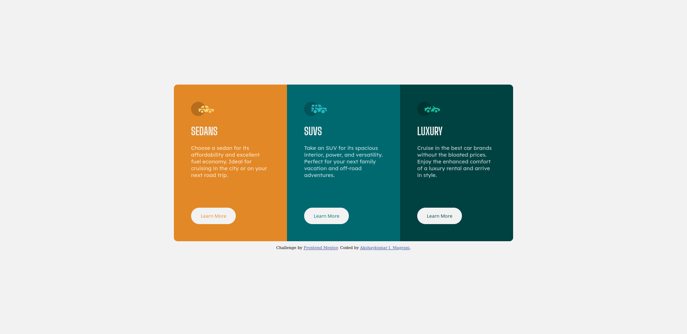

# Frontend Mentor - 3-column preview card component solution

This is a solution to the [3-column preview card component challenge on Frontend Mentor](https://www.frontendmentor.io/challenges/3column-preview-card-component-pH92eAR2-).

## Table of contents

- [Overview](#overview)
  - [The challenge](#the-challenge)
  - [Screenshot](#screenshot)
  - [Links](#links)
- [My process](#my-process)
  - [Built with](#built-with)
  - [What I learned](#what-i-learned)
  - [Continued development](#continued-development)
- [Author](#author)

## Overview

### The challenge

Users should be able to:

- View the optimal layout depending on their device's screen size
- See hover states for interactive elements

### Screenshot



### Links

- Solution URL: [Add solution URL here](https://github.com/akshaymagrani/webDev-n16-3-column-preview-card-component-main)
- Live Site URL: [Add live site URL here](https://web-dev-n16-3-column-preview-card-component-3ge08588c.vercel.app/)

## My process

### Built with

- Semantic HTML5 markup
- CSS custom properties
- Flexbox
- Mobile-first workflow

### What I learned

Recap over some of your major learnings while working through this project.

```css
/*Use of CSS variables*/
:root {
  /*bg-colors*/
  --brightOrange: hsl(31, 77%, 52%);
  --darkCyan: hsl(184, 100%, 22%);
  --veryDarkCyan: hsl(179, 100%, 13%);
  /*text-colors*/
  --paragraphs: hsla(0, 0%, 100%, 0.75);
  --bg_headings_buttons: hsl(0, 0%, 95%);
}
/*D.R.Y Code using multiple classes at once*/
.sedan,
.suv,
.luxury {
  padding: 3rem;
  max-width: 220px;
  margin: auto;
}
```

If you want more help with writing markdown, we'd recommend checking out [The Markdown Guide](https://www.markdownguide.org/) to learn more.

### Continued development

Techniques I found useful that I want to refine and perfect:

- Transitions before and after pages load.
- Libraries to make animation easier.
- Difference between different display styles and associated position values.

## Author

- Website - [Akshaykumar I. Magrani](https://www.your-site.com)
- Frontend Mentor - [@akshaymagrani](https://www.frontendmentor.io/profile/akshaymagrani)
- Twitter - [@magraniakshay](https://www.twitter.com/akshaymagrani)
